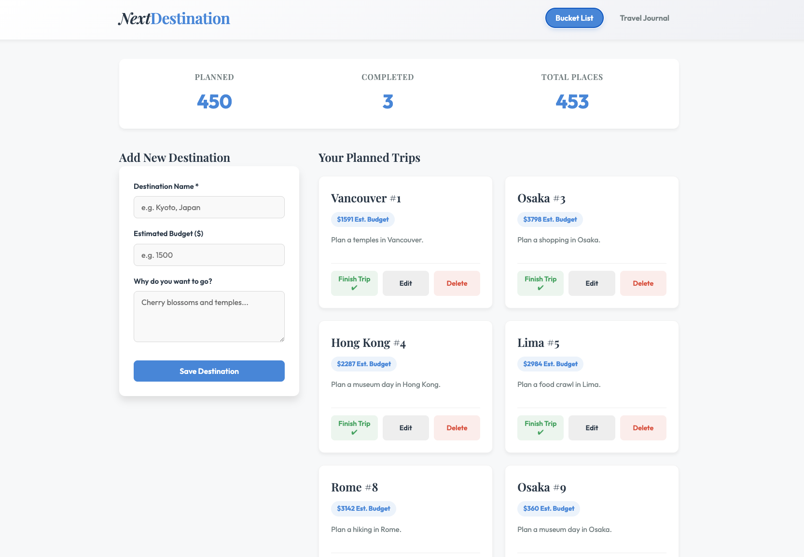

# NextDestination (NEU CS5610 Project 2)

NextDestination is a full-stack web application that helps travelers manage their trip plans and memories.

Core idea: a central place to move from a “dream trip” to a “finished memory.”

---

## Authors
- Yazi Zhang
- Jianyu Qiu

---

## Class
NEU CS5610 – Web Development

---

## Design Document
### Description: NextDestination is a simple full-stack web app for travelers to manage their trip plans and memories. We want to build this because people often lose track of their travel ideas or forget details after a trip.

- Core Idea: A central place to manage the transition from a "dream trip" to a "finished memory."
- Tech Stack: We will use Node.js, Express, and Vanilla ES6 with the MongoDB driver.
- Constraint Check: No React, No Mongoose, and No Server-Side Rendering will be used.

### User Personas:

    - Yazi: A person who loves planning and wants a clear list of future trips to stay excited.
    - Jianyu: Someone who wants a private space to record how they felt about a trip so they don't forget the memories.
    - Luna: A frequent traveler who needs to separate places they have already visited from the ones they are still planning.

### User Stories:
Destinations & Discovery (Yazi Zhang)

    - Create: As a user, I want to add a new destination with a name, description, and budget.
    - Browse: As a user, I want to search and browse my planned places to pick my next trip.
    - Update: As a user, I want to edit destination details because travel plans often change.
    - Delete: As a user, I want to remove a destination if I am no longer interested, keeping my list clean.

Travel Journal & Insights (Jianyu Qiu)

    - Convert: As a user, I want to move a planned destination to "Completed" with one click.
    - Review: As a user, I want to give a star rating and write a short review for my finished trips.
    - Filter: As a user, I want to toggle between "Bucket List" and "Journal" views to focus on different stages.
    - Stats: As a user, I want to see a simple summary of my travel history (like total places visited).

### Design Mockup


#### UI/UX Breakdown:
*   **Header Navigation**: Features a sticky header with a clean logo and prominent toggle buttons to switch between the "Bucket List" (planning phase) and "Travel Journal" (completed phase) views.
*   **Live Statistics Dashboard**: At the top of the main layout, three dynamic metric cards (`Planned`, `Completed`, `Total Places`) keep the user informed of their overall travel history.
*   **Split Layout (Bucket List View)**:
    *   **Left Column (Sticky Form)**: A clean, accessible form to "Add New Destination" requiring a Name, Estimated Budget, and Description. It uses standardized input fields with focus-ring highlights.
    *   **Right Column (Trip Grid)**: A responsive CSS grid displaying "Your Planned Trips". Each trip is rendered as a clean white card with a subtle shadow.
*   **Card Design**: 
    *   Each destination card features bold typography for the title, a pill-shaped badge for the budget, and a clamped text description. 
    *   On hover, the cards slightly elevate, and a vibrant blue primary-color bar smoothly expands along the left edge using CSS pseudo-elements (`::before`) to create an interactive, premium feel.
    *   Action buttons (Finish Trip ✔, Edit, Delete) are anchored to the bottom of each card, with distinct hover states and color coordination (e.g., green for completion, red for deletion).

### Project Objective
Build a backend application using:
- Node.js
- Express
- MongoDB (official driver, NOT Mongoose)
- Vanilla JavaScript (client-side rendering)
- No React
- No Server-Side Rendering
- No template engines

---

## Features

### Bucket List
- Add a destination (name, description, budget)
- Search destinations
- Edit destination
- Delete destination
- One-click convert to completed trip

### Travel Journal
- Rate completed trips (1–5 stars)
- Write short review
- Edit / Delete journal entries
- Filter journal entries
- View travel statistics

---

## How to Run Locally

### 1. Install dependencies
```bash
npm install
